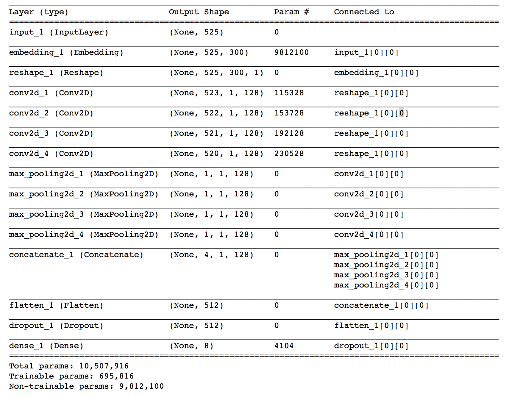
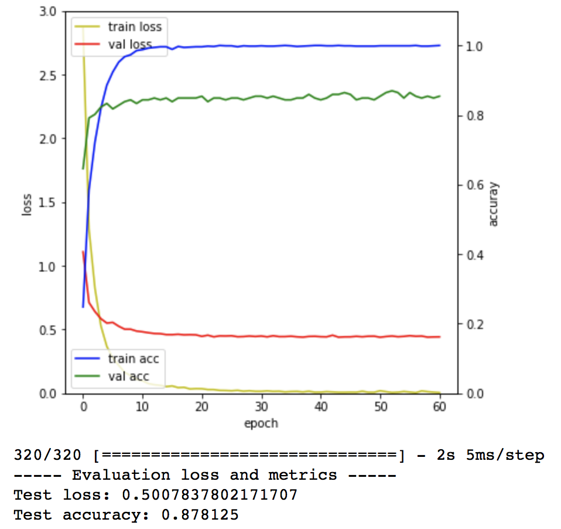
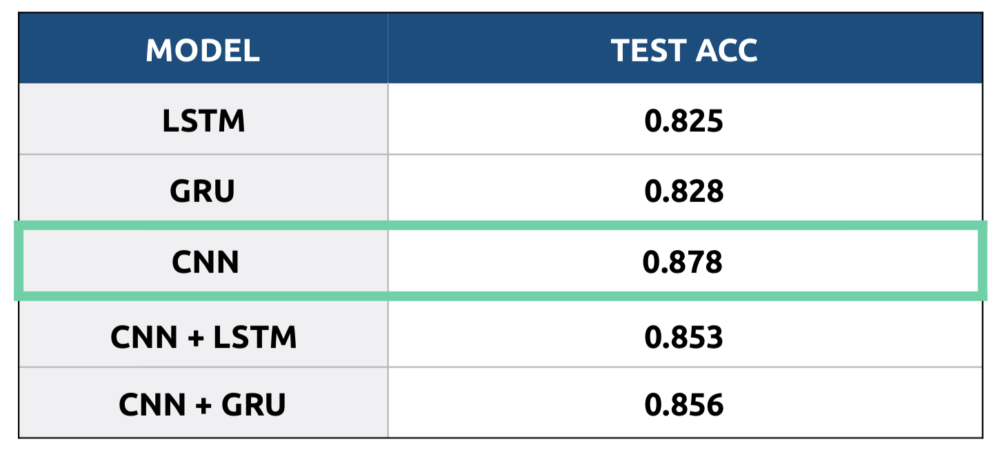

# Korean News Data Classificaiton

정치(0), 경제(1), 사회(2), 생활/문화(3), 세계(4), 기술/IT(5), 연예(6), 스포츠(7)로 분류되어 있는 1600개의 한국어 기사를 4:1(Train set : Test set) 비율로 나누어, Test Set의 클래스를 추론.

## 1. Pre-Processing
- Mecab 한국어 형태소 분석기 사용
- 동사와 명사만 활용

## 2. Word Embedding
- Fast Text 사용 
- 32707 Vocab size Word-Vector Model 생성

## 3. Model
- LSTM, GRU, CNN, CNN+LSTM, CNN+GRU 5가지 모델의 성능 비교
- Validation Ratio : 0.15

## 4. Result

 
 
 

